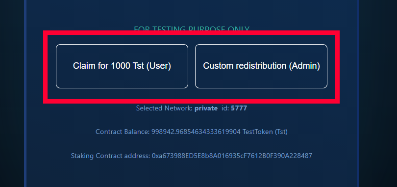

# Staking dApp

A blockchain-based staking application built with **React**, **Solidity**, and deployed on Ethereum test networks (**Ganache**, **Ropsten**, **Rinkeby**).

---

## License
 
This project is licensed for **educational and reference purposes only**.
Use, modification, or resale of the code requires obtaining a license from the author.

* License Fee: **0.3 ETH**
---

## Key Features

* ERC20 TestToken integration
* Token Staking contract (stake, unstake, reward redistribution)
* Multiple staking pools with configurable APY
* Web3 and MetaMask integration
* Support for Ropsten and Rinkeby deployments
* Responsive frontend with optimized UI

---

## Updates & Improvements

* [x] Added ERC20 TestToken and staking contracts
* [x] Stake, Unstake, Redistribute functionality implemented
* [x] Web3 + MetaMask integration with user checks
* [x] Custom staking pools with adjustable APY
* [x] Frontend refactor and mobile optimization
* [x] Contract verified on test networks

---

## Installation

Clone repository and install dependencies:

```bash
git clone https://github.com/steto1/Staking-Dapp.git
cd Staking-DApp
npm install
npm start
```

---

## Testing

Run contract tests with Truffle:

```bash
truffle test
```

Mocha tests validate deployment, staking, unstaking, redistribution, and APY adjustment.

---

## Admin Scripts

Located in `/scripts` folder:

* Update APY:

  ```bash
  truffle exec scripts/changeAPY.js 0.137
  ```
* Redistribute rewards:

  ```bash
  truffle exec scripts/redistribute.js
  truffle exec scripts/redistribute.js custom
  ```

---

## Deployment

1. Configure `truffle-config.js` with Infura and mnemonic keys.
2. Compile:

   ```bash
   truffle compile
   ```
3. Deploy locally (Ganache):

   ```bash
   truffle migrate --reset
   ```
4. Deploy to testnet:

   ```bash
   truffle migrate --network rinkeby --reset
   ```
5. Verify on Etherscan:

   ```bash
   truffle run verify TestToken --network rinkeby
   ```

---

## Contract Addresses

**TokenStaking Contract:**

* Ropsten: [View](https://ropsten.etherscan.io/address/0x0Fab2A018bB44DD2a6Ef7C55F057Dd9d9eC1B19F#contracts)
* Rinkeby: [View](https://rinkeby.etherscan.io/address/0xAf9352B33E9B08A86dD04fcD8533DbC75BD2c8d1#contracts)

**TestToken Contract:**

* Ropsten: [View](https://ropsten.etherscan.io/address/0x0190f8041454587179053eb854541644AbAf4048#contracts)
* Rinkeby: [View](https://rinkeby.etherscan.io/address/0xb54a6e9C039DAC3C4AD290EdAC082e8680af9488#contracts)

Admin Address: `0x33496a49410F5F9941AbCca399168dF1c0df9402`

---

## Notes

* The **Claim Test Tokens** and **Redistribute Rewards** functions are for testing purposes only and should not be included in production deployments.
* Known issues: Certain frontend functions are not production-ready.



